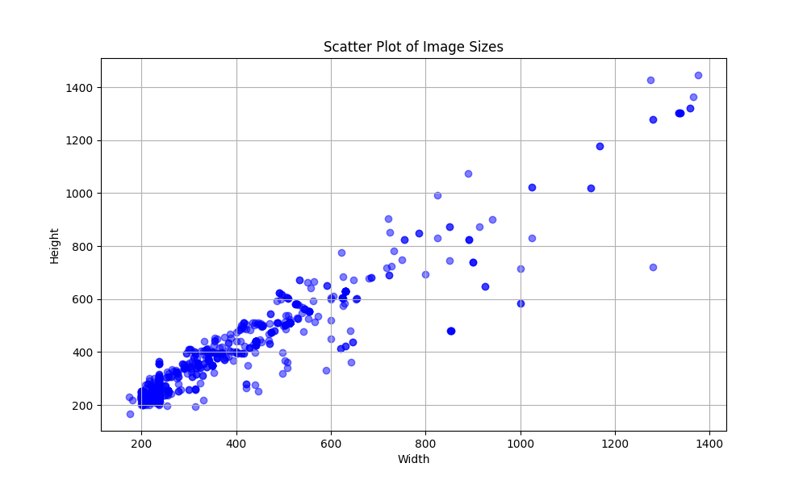
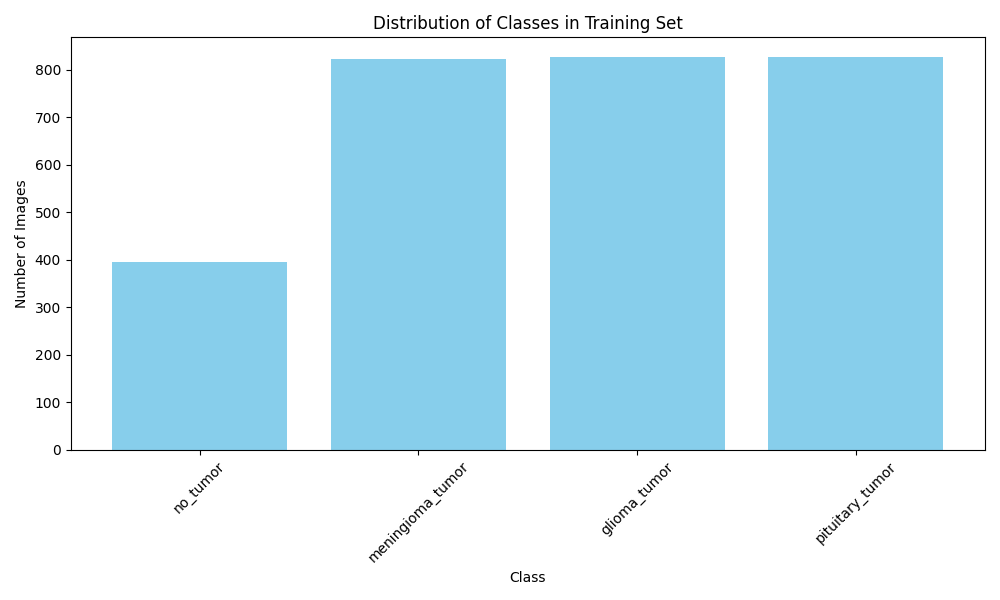
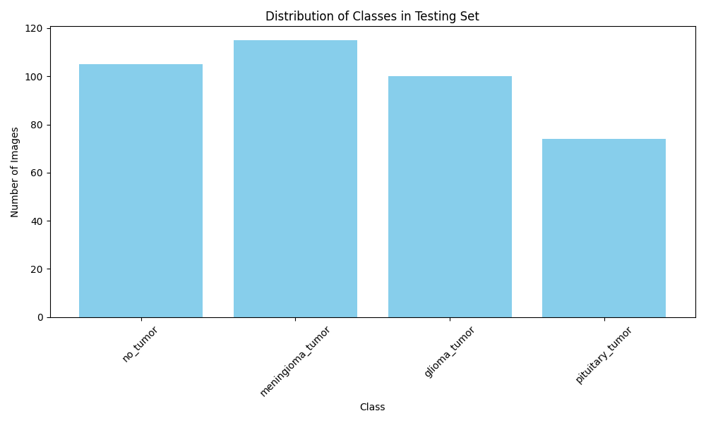
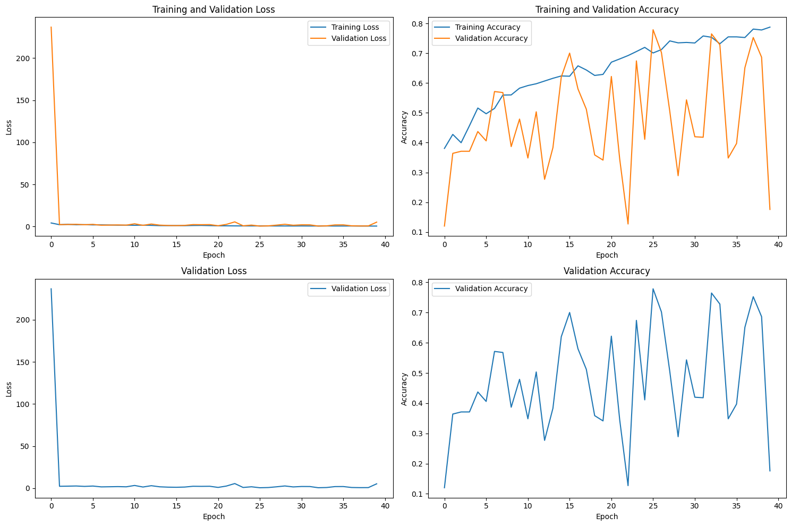
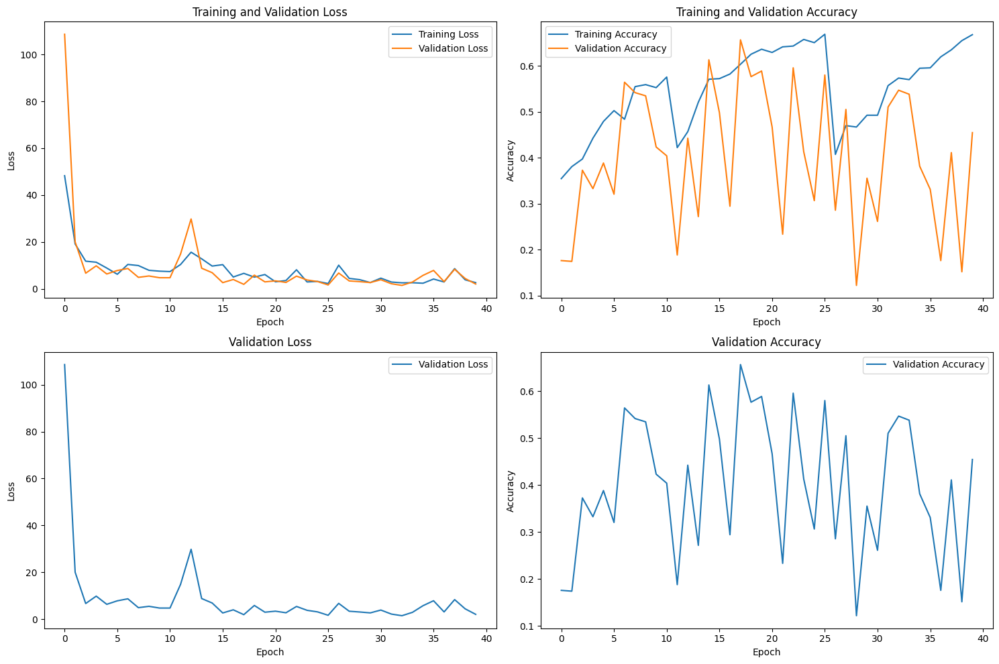
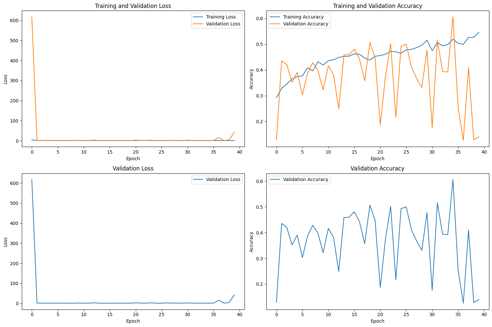
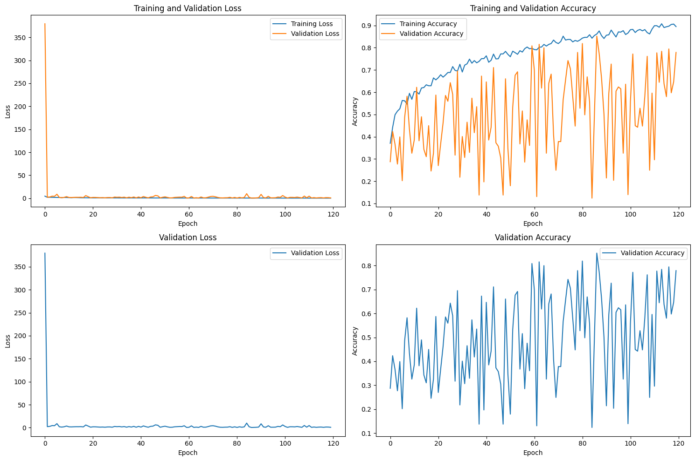
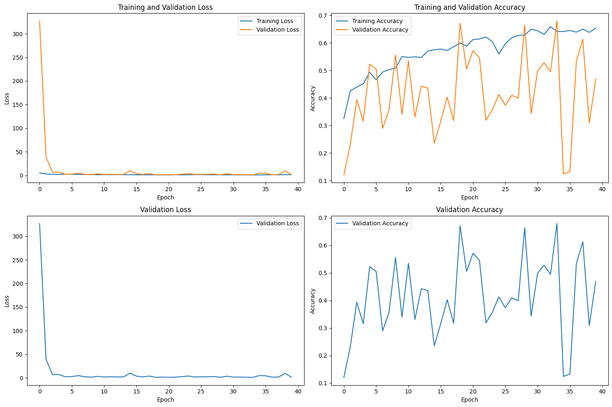

# masinsko_ucenje
Kaggle dataset: https://www.kaggle.com/datasets/sartajbhuvaji/brain-tumor-classification-mri/

**Glavni kod se nalazi u folderu resnet**

# Uvod i cilj projekta

U oblasti mašinskog učenja, posebno u vezi sa computer vision-om, konvolutivne neuronske mreže (CNN) predstavljaju ključnu tehnologiju koja omogućava efikasnu obradu slika i prepoznavanje oblika.
U ovom projektu testirane su različite arhitekture konvolutivnih neuronskih mreža kako bi se napravila klasifikacija MRI slika mozga u cilju prepoznavanja tri vrste tumora mozga, kao i prepoznavanje da li je tumor mozga detektovan na slici. Korišćen je skup podataka pod imenom "Brain Tumor Classification (MRI)".

# Baza podataka

U projektu korišćena je baza podataka pod imenom "Brain Tumor Classification (MRI)". U bazi se nalaze MRI slike mozga koje su podeljene u 4 klase :
1. "glinoma_tumor"
2. "meningioma_tumor"
3. "pituitary_tumor"
4. "no_tumor"

Slike u data-set-u su različitih velicina pa je bilo potrebno uraditi resizing kako bi sve bile istih dimenzija. Na slici je prikazana raspodela veličina slika iz data-set-a: 

# Training i Test skup

Podela na training i test skup je izvršena sa razmerom 1/5 (training = 80%, test = 20%). Na slikama dole je prikazana raspodela training i test skupa po klasama.

# Kreiranje Modela

Za analizu slika koristi se prethodno obučeni model ResNet101. U ovoj fazi se vrši i fine-tuning. Nakon toga se kreira novi sekvencijalni model, koji sadrži slojeve za konverziju sivih slika u trokanalne, ResNet101, globalni avg-pooling, nekoliko dodatnih slojeva, normalizaciju partija i dropout sloj.

Model se kompajlira sa optimizatorom Adam, eksponencijalnim rasporedom učenja i redom L2 regularizacije na težinama. Ciljna funkcija je sparse_categorical_crossentropy, a merilo performansi je tačnost(accuracy).

# Učenje Modela

U glavnoj funkciji main, prvo se učitavaju slike i oznake za treniranje. Zatim se podaci dele na trening i validacione skupove.

Kreiran je objekat za generisanje dodatnih podataka (data augmentation) kako bi se poboljšala sposobnost modela da generalizuje. Dodatno, implementiran je model checkpointing kako bi se sačuvali težinski parametri modela tokom treniranja na osnovu najbolje tačnosti na validacionom skupu.

Model se trenira na podacima za treniranje, a rezultati se čuvaju u Excel datoteci "training_metrics.xlsx". Model se evaluira na test skupu, koristeći težine modela koji su postignuti najboljom tačnošću tokom treniranja.

# Evaluacija Modela

Nakon treniranja, model se evaluira na test skupu kako bi se dobila tačnost modela na nepoznatim podacima. Dobijeni rezultati se ispisuju kako biste videli tačnost modela u poslednjoj iteraciji treniranja.

# Rezultati 

Na slikama dole prikazani su rezultati modela u 6 odvojenih verzija modela. 
U verzijama su isprobane : ResNe150 i ResNet101 modeli, pocetne tezine(isprobane su "ImageNet" i "None"), broj zamrznutih slojeva kao i velicine potpuno povezanih slojeva(256, 512, 128...), DropOut sa razlicitim rate-ovima (0.2, 0.3, 0.5) kao i batch normalizacija.

# Run 1

# Run 2

# Run 4

# Run 5

# Run 6

