# masinsko_ucenje
Kaggle dataset: https://www.kaggle.com/datasets/sartajbhuvaji/brain-tumor-classification-mri/

# Uvod i cilj projekta

U oblasti mašinskog učenja, posebno u vezi sa computer vision-om, konvolutivne neuronske mreže (CNN) predstavljaju ključnu tehnologiju koja omogućava efikasnu obradu slika i prepoznavanje oblika.
U ovom projektu testirane su različite arhitekture konvolutivnih neuronskih mreža, kao i pretrenirana Resnet mreža kako bi se napravila klasifikacija MRI slika mozga u cilju prepoznavanja tri vrste tumora mozga, kao i prepoznavanje da li je tumor mozga detektovan na slici. Korišćen je skup podataka pod imenom "Brain Tumor Classification (MRI)". 

# Baza podataka

U projektu korišćena je baza podataka pod imenom "Brain Tumor Classification (MRI)". U bazi se nalaze MRI slike mozga koje su podeljene u 4 klase :
1. "glinoma_tumor"
2. "meningioma_tumor"
3. "pituitary_tumor"
4. "no_tumor"

Slike u data-set-u su različitih velicina pa je bilo potrebno uraditi resizing kako bi sve bile istih dimenzija. Na slici je prikazana raspodela veličina slika iz data-set-a: 

# Training i Test skup

Slike u bazi podataka su već podeljene na trening i test skup(2874 za trening i 398 za test). Na slikama dole je prikazana raspodela training i test skupa po klasama.

# Predprocesiranje
- Slike su konvertovane u crno-bele i promenjene dimenzije svih slika na 224x224 piksela.
- Pošto su slike iz baze podataka crno-bele, konvertovane su u grayscale format što pojednostavljuje procesiranje i smanjuje zahtevnost računanja, jer se radi sa samo jednim kanalom po slici umesto tri.
- Slike su normalizovane tako što su vrednosti piksela deljene sa 255.0, što rezultira vrednostima piksela u rasponu od 0 do 1.
- Slike i imena klasa su pretvorene u numpy nizove za dalju obradu.

# Augmentacija Podataka:

Augmentacija povećava diverzitet trening podataka i pomaže u smanjenju preprilagođavanja. Za augmentaciju podataka koristi se **ImageDataGenerator** koji omogućava transformacije kao što su rotacija, promene u širini i visini, širenje, zumiranje i horizontalno okretanje. 

# Modeli

Testirane su različite arhitekture konvolucionih neuronskih mreža (CNN) kako bi se optimizovala preciznost klasifikacije MRI slika. Svaka arhitektura je imala različite karakteristike i podešavanja, detaljno opisane u nastavku:

# CNN modeli

## **Konvolucija v1**

*Osnovni model koji služi kao referentna tačka za dalje eksperimente.*

-**Arhitektura**: Standardni slojevi konvolucije i agregacije, uključujući tri  sloja konvolucije i tri **MaxPooling** sloja.

-**Aktivaciona funkcija**: ReLU za konvolucione slojeve, Softmax za izlazni sloj(isto za sve modele).

-**Broj epoha**: 70 

-**Dodatne tehnike**: Early stopping za kontrolu preprilagođavanja.

## **Konvolucija v2**

-**Arhitektura**: Povećan broj filtera i slojeva, dodat BatchNormalization posle svakog konvolucionog sloja, korišćen **AveragePooling** umesto MaxPooling.

-**Broj epoha**: 20

## **Dropout 0.5**

-**Arhitektura**: Uključivanje Dropout sloja sa metaparametrom od 0.5.

-**Broj epoha**: 40

-**Dodatne tehnike**: Ručno postavljen learning rate = 0.005 za optimizator Adam. Veoma loše se pokazao...

## **Dropout 0.5 v2**

-**Arhitektura**:  Dropout sloj sa metaparametrom od 0.5, duže treniran.

-**Broj epoha**: 100

## **Dropout 0.4**

-**Arhitektura**: Dropout sa metaparametrom od 0.4, četiri sloja konvolucije.

-**Broj epoha**: 40

## **Dropout 0.2**

-**Arhitektura**: Dropout sloj sa metaparametrom od 0.2, early stopping

-**Broj epoha**: 40 

# Resnet modeli

Isprobani su ResNet 50 i ResNet 101 modeli, sa različitim modifikacijama u arhitekturi. Promene su uključivale broj epoha, sa i bez dropout-a,broj "odmrznutih" slojeva ResNet mreže(fine tuning)... Ovi eksperimenti su sprovedeni kako bi se procenila efikasnost različitih pristupa i kako bi se našla optimalna konfiguracija.

## Resnet 50 

-**Arhitektura** AveragePooling, BatchNormalization, Dropout(0,2)

-**Broj odmrznutih slojeva** = 0

-**Broj epoha** : 20

## Resnet 50 bez Dropout-a

-**Arhitektura** AveragePooling

-**Broj odmrznutih slojeva** = 4

-**Broj epoha** : 10

## Resenet 50, 40 epoha

-**Arhitektura** AveragePooling

-**Broj odmrznutih slojeva** = 6

-**Broj epoha** : 40

## Resnet 101

-**Arhitektura** AveragePooling, BatchNormalization, Dropout(0,4)

-**Broj odmrznutih slojeva** = 4

-**Broj epoha** : 20

## Resnet 101 bez Dropout-a

-**Arhitektura** AveragePooling

-**Broj odmrznutih slojeva** = 10

-**Broj epoha** : 20

# Evaluacija

Model je evaluiran na zasebnom test setu, a rezultati su prikazani kroz classification report koji pruža detaljan uvid u performanse modela po klasama.

# Rezultati

Rezultati svih modela su prikazani u tabeli, poredjani od najboljeg ka najgorem:

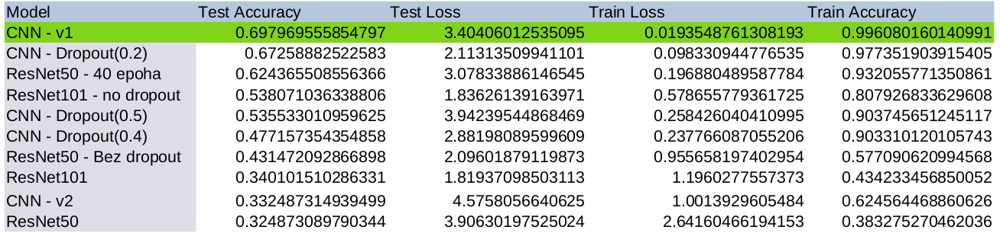

# Tabela

Vrednosti za accuracy i loss se mogu videti za svaki model na trening i validacionom skupu kroz epohe:

## **Konvolucija v1**
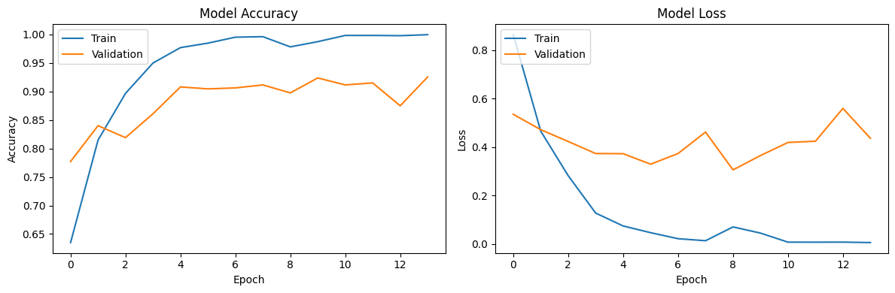

**Accuracy**

Tacnost na trening setu brzo raste već nakon prvih nekoliko epoha, dosezuci vrlo visoke vrednosti (iznad 0.95), sto pokazuje da model efikasno uci iz trening podataka.
Razlika između Treninga i Validacije: Tacnost na validacionom setu prati trening tacnost do određene mere, ali postoji vidljiva razlika i neka varijacija, posebno nakon oko 5. epohe. Ovo može biti indikacija početka preprilagođavanja, jer model bolje radi na trening podacima nego na validacionim.

**Loss**

Greska na trening setu brzo opada u prvim epohama i ostaje na niskom nivou, što sugeriše da model brzo minimizira greške na trening podacima.
Greska validacije nakon inicijalnog pada, pokazuje varijacije i generalno veće vrednosti u poređenju sa trening greskom, što ponovo može ukazivati na preprilagođavanje

Uzeti sve ovo u obzir ovo je najbolji model sa tacnoscu na test skupu od 0.69797  

## **Konvolucija v2**
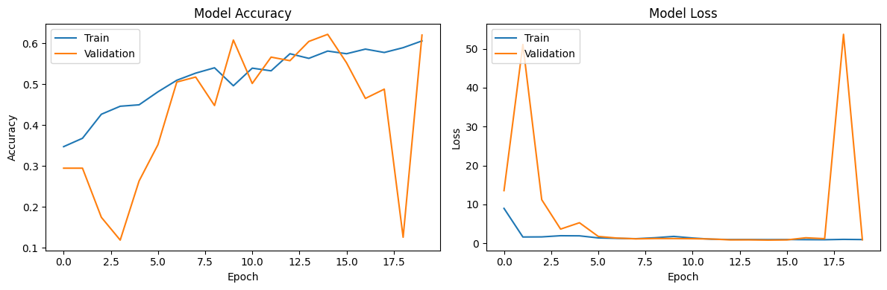

**Accuracy**

Tacnost na validacionom skupu pokazuje znacajne oscilacije kroz epohe, tacnost je takodje dosta niska sto nam govori da ovakva akhitektura mreze nije pogodna za ovaj skup podataka. Takodje se moze uocti da je tacnost na trening skupu relativno stabilna kroz epohe, dok na skupu validacije dosta osciluje, to nam govori da je model verovatno preprilagodjen jer se model lose ponasa sa nepoznatim podacima iz validacionog skupa

**Loss**

Greska validacije dosta visoko osciluje dok je greska na trening skupu stabilna. Ovo nam takodje govori da je model preprilagodjen jer  model dobro uci trening podatke ali ne generalizuje dobro na validacionim podacima.

## **Dropout 0.5**
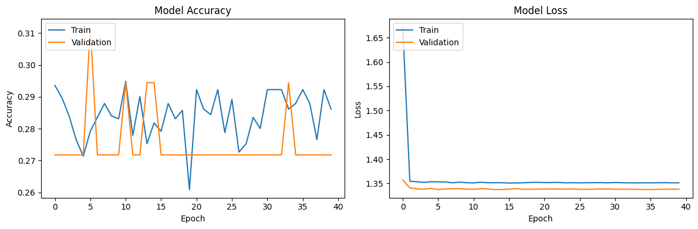

Karakeristika modela : rucno postavljen learning rate na 0.005

**Accuracy** 

Visoke oscilacije u tačnosti: Tačnost na treningu i validaciji pokazuje znatne oscilacije kroz sve epohe. Ovo može biti posledica prevelikog learning rate-a, koji uzrokuje da se optimizator pravi prevelike korake i time stalno preskace optimum.

Niska tačnost: Maksimalne vrednosti tačnosti koje ne prelaze 0.3 ukazuju na to da model ima poteškoće sa učenjem iz dostupnih podataka, što bi takođe moglo biti posledica neadekvatnog learning rate-a koji onemogućava stabilno učenje.

**Loss**

Greska na trening setu brzo pada na početku treniranja, što je tipično za situacije sa većim learning rate-om, ali se zatim stabilizuje, što ukazuje na to da model ne uspeva dodatno poboljšati svoje predikcije uprkos daljem treniranju.

Stabilizacija greske: Greska na validacionom skupu pokazuje sličan trend stabilizacije sto nam govori da je ovaj model dostigao stoj maksimum generalizacije

## **Dropout 0.5 v2**
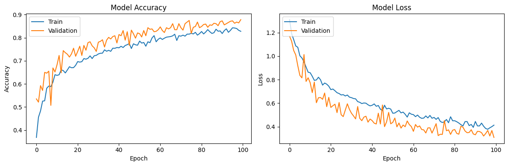

**Accuracy**

Tacnost na trening i validacionom skupu postepeno raste. Oko 60te epohe pocinje da se stabilizuje sto nam govori da su one verovatno nepotrebne i da bi trebalo ranije zaustaviti treniranje

**Loss**

Nakon početnog pada, greska na oba seta pokazuje tendenciju konvergencije, posebno nakon 60. epohe sto nam takodje govori da nije bilo potrebno trenirati model ovoliko dugo

## **Dropout 0.4**
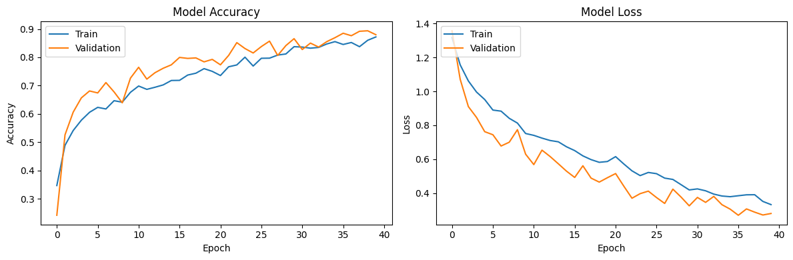

**Accuracy** 

Trening : tačnost na trening setu pokazuje konzistentan rast tokom prvih nekoliko epoha, stabilizuje se oko 30. epohe. Ovo ukazuje na to da model uspešno uči iz trening podataka.

Validacija : tačnost na validacionom setu takođe pokazuje sličan trend rasta i stabilizuje se oko iste vrednosti kao i trening tačnost. To je dobar znak da model nije preprilagođen na trening podacima.

**Loss**

Trening : Greska na trening setu opada brzo tokom početnih epoha i nastavlja blago opadati, stabilizujući se prema kraju treniranja. Ovo pokazuje da model postaje sve efikasniji u predviđanju trening podataka.

Validacija : Greska na validacionom setu pokazuje sličan trend opadanja kao i trening gubitak, što je takođe znak dobrog generalizovanja. To znači da model dobro radi na neviđenim podacima.

## **Dropout 0.2**
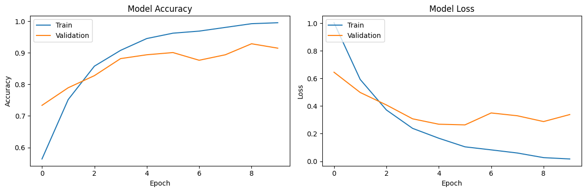

**Accuracy**

Tacnost na trening skupu postepeno raste i dostize vrlo visoke vrednosti blizu 1.0. Tacnost na validacionom skupu takodje raste, ali se stabilizuje oko 0.85 nakon nekoliko epoha.
Tacnost na validacionom skupu prati tačnost na trening skupu, sto ukazuje na dobru sposobnost generalizacije modela. Medjutim, postoji mali pad performansi na validacionom skupu pred kraj treninga, što može biti znak blagog preprilagodjavanja.

**Loss**

Greska na trening setu dramaticno opada tokom prvih nekoliko epoha i nastavlja da opada do kraja treninga. Greska na validacionom skupu takodje pokazuje stabilan pad, ali ostaje nesto visa u poredjenju sa trening greskom.
Nakon inicijalnog pada, greska na validacionom setu se stabilizuje, sto ukazuje na to da je model naucio neke relevantne karakteristike iz podataka, ali takodje ukazuje na moguci pocetak preprilagodjavanja.

## Resnet 50

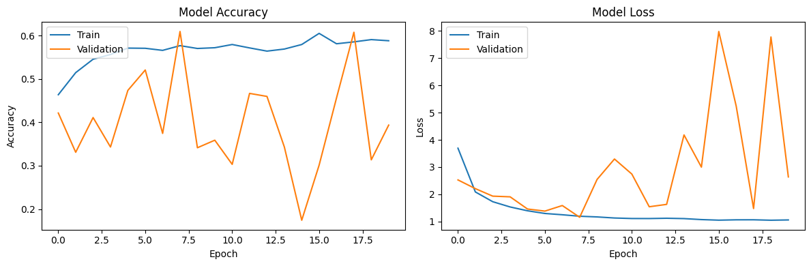

**Accuracy**

Tacnost na trening skupu postepeno raste i dostize maksimalnu vrednost od oko 0.6. acnost na validacionom skupu osciluje i pokazuje nestabilnost, ali se kreće oko 0.4. Ovo ukazuje na to da model ima problema sa generalizacijom i da postoji značajna razlika između trening i validacionih performansi, što može biti znak preprilagodjavanja

**Loss**

Greska na trening setu opada tokom prvih nekoliko epoha i nastavlja da opada, dostizuci vrednosti ispod 1. Greska na validacionom skupu takođe pokazuje pad, ali sa značajnim oscilacijama. Nakon početnog pada, validaciona greška ostaje viša i nestabilnija u poređenju sa trening greškom, što ukazuje na to da model možda nije u stanju da uči relevantne karakteristike podataka dovoljno dobro, što je još jedan znak mogućeg preprilagodjavanja

Jedan od mogućih razloga za loše performanse je što poslednji slojevi ResNet mreže nisu odmrznuti za fine tuning.

## Resnet 50 bez Dropout-a

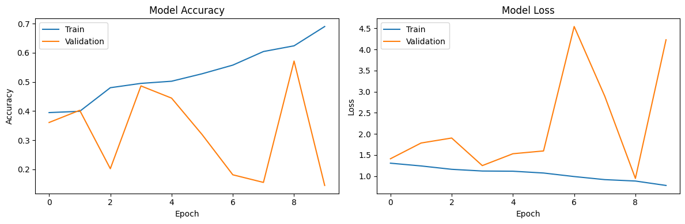

**Accuracy**

Tacnost na trening skupu raste do oko 0.7. Tacnost na validacionom skupu osciluje između 0.2 i 0.5, ukazujući na probleme sa generalizacijom.

**Loss**

Greska na trening setu opada ispod 1. Greska na validacionom skupu osciluje, ukazujući na nestabilnost i moguće preprilagodjavanje.

## Resnet 50, 40 epoha

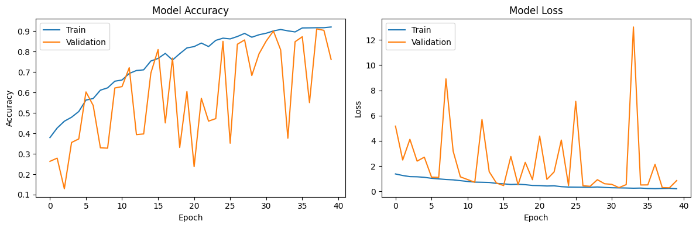

**Accuracy**

Tacnost na trening skupu raste do oko 0.9, što pokazuje da model dobro uči na trening podacima. Tacnost na validacionom skupu osciluje između 0.1 i 0.8, ali pokazuje trend ka boljem. Ove oscilacije sugerišu da model nije u stanju da konstantno dobro generalizuje na neviđene podatke, što može biti rezultat preprilagodjavanja

**Loss**

Greska na trening setu opada ispod 1, što pokazuje da model smanjuje grešku na trening podacima. Greska na validacionom skupu osciluje značajno, sa vrednostima koje se kreću između 0 i 12. Ova velika varijabilnost u validacionoj grešci ukazuje na to da model ima poteškoća u učenju stabilnih karakteristika iz validacionih podataka. Takve oscilacije mogu biti znak preprilagodjavanja, gde model dobro radi na trening podacima ali ne uspeva da generalizuje na validacioni skup.

## Resnet 101

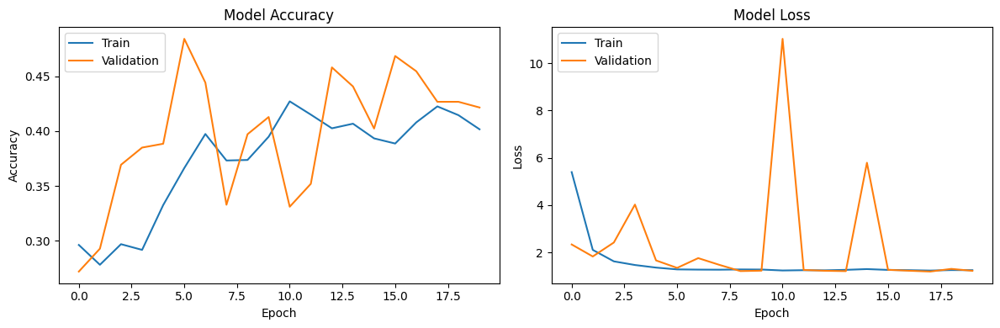

**Accuracy**

Tacnost na trening skupu raste do oko 0.45, što nije preterano dobar rezultat za trening skup. Tacnost na validacionom skupu osciluje između 0.3 i 0.45, ali pokazuje trend ka boljem. Ove oscilacije ukazuju na nestabilnu generalizaciju, što može biti rezultat preprilagodjavanja

**Loss**

Greska na trening setu opada ispod 2, što pokazuje da model smanjuje grešku na trening podacima, ali ne dovoljno dobro. Greska na validacionom skupu osciluje, sa vrednostima koje se kreću između 1 i 10. Ova varijabilnost u validacionoj grešci ukazuje na to da model ima poteškoća u učenju stabilnih karakteristika iz validacionih podataka. Takve oscilacije mogu biti znak preprilagodjavanja, gde model dobro radi na trening podacima, ali ne uspeva da generalizuje na validacioni skup.

## Resnet 101 bez Dropout-a

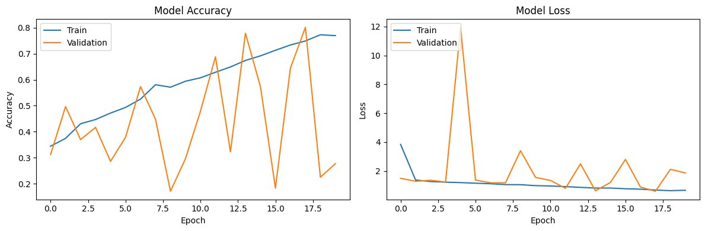

**Accuracy**

Tacnost na trening skupu raste do oko 0.8, što pokazuje da model dobro uči na trening podacima. Tacnost na validacionom skupu osciluje između 0.3 i 0.7, ali pokazuje trend ka boljem. Ove oscilacije ukazuju na nestabilnu generalizaciju, što može biti rezultat preprilagodjavanja

**Loss**

Greska na trening setu opada ispod 2, što pokazuje da model smanjuje grešku na trening podacima, ali ne dovoljno dobro. Greska na validacionom skupu osciluje, sa vrednostima koje se kreću između 1 i 12. Ova varijabilnost u validacionoj grešci ukazuje na to da model ima poteškoća u učenju stabilnih karakteristika iz validacionih podataka. Takve oscilacije mogu biti znak preprilagodjavanja, gde model dobro radi na trenisng podacima, ali ne uspeva da generalizuje na validacioni skup.

